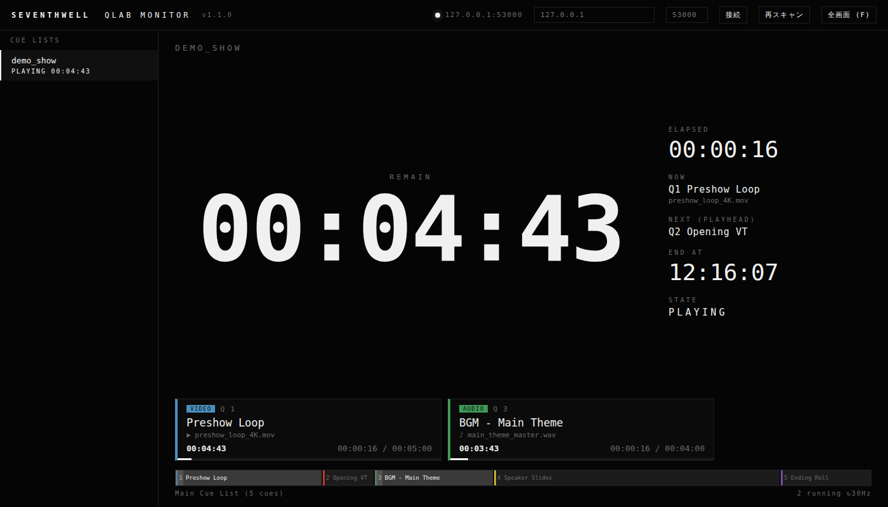

# SW QLab Monitor

Read-only status monitor for Figure 53 QLab 4/5 live show playback, by [SEVENTHWELL](https://seventh-well.com).

A standalone tool that connects to QLab over LAN and puts a big, readable
countdown on any screen in the room — laptop, tablet, or a spare monitor at FOH.

**Single Python file with no dependencies** (standard library only) and serves a
browser UI, so any device on the same network can watch the same numbers.



## Why

During a show you often need to know one thing from across the room: **how much time is left.**
The operator's screen is busy, the console is at the other end of the venue, and the director
just wants a number. This tool puts that number on a screen, in a font you can read from
ten meters away.

## Features

- **Big REMAIN readout**, amber at 60 s, red at 10 s
- **Running cue cards** — cue number, name, media file name, color, and a progress bar for
  every cue currently playing
- **Cue list overview** with the playhead
- **Multi-device** — monitor several QLab workspaces at once (main + backup)
- **Browser UI** — open `http://<host>:8780` from a tablet at the desk
- **Bitfocus Companion** integration — push remaining time into custom variables and show it
  on a Stream Deck button
- **Fullscreen focus mode** (`F`) — just the numbers, nothing else
- **Read-only**: this tool never sends GO/STOP or any other control commands

## Requirements

- Python 3.8+ (Windows, macOS, Linux)
- Network access to the QLab machine
- No `pip install` needed

## Quick start

```bash
python sw_qlab_monitor.py --host 192.168.0.30 --console

# Try it without hardware — ships with a built-in dummy QLab server
python sw_qlab_monitor.py --demo
```

On Windows, double-click `SW-QLAB-MONITOR.bat` for a small settings window (no console).
On macOS (running on the same Mac as QLab), use `SW-QLAB-MONITOR-mac.command`.

See [README.ja.md](README.ja.md) for the full setup guide, including the QLab-side OSC
configuration and Companion/Stream Deck integration (Japanese).

## Protocol notes

Written from the vendor documentation and verified against real hardware.

QLab — OSC 1.1 over TCP on port 53000, framed with double-END SLIP (RFC 1055). Replies
arrive as `/reply` + the original address with a JSON payload. Requires *Workspace Settings
→ Network → OSC Access → Allow OSC Connections*. The OSC API has no video/audio data or cue
thumbnails, so this tool identifies cues by media file name, cue type, and cue color instead.

## License

MIT — see [LICENSE](LICENSE).

## Disclaimer

Not affiliated with, endorsed by, or supported by Figure 53 or Bitfocus AS.
QLab, Stream Deck, and Companion are trademarks of their respective owners.
This tool is a read-only monitor built against publicly documented APIs. Test it in your
own rig before relying on it in a show.
